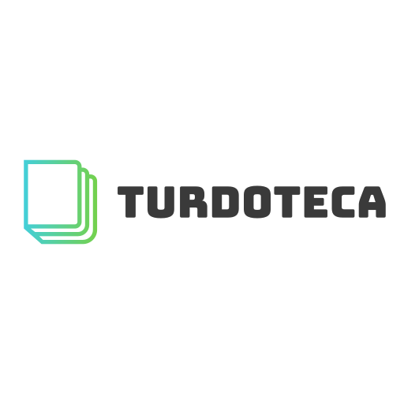

# ¿Cómo funciona Turdoteca?

Para comprender el funcionamiento de la página es necesario empezar por pasos:

## 1. Guardado de libros

En `/bookFiles/` es donde se guardan los libros, realizando la siguiente secuencia:

1. Se escanea el directorio `./epubs/`.
2. Si el directorio `./bookSave/` no existe se crea.
3. Por cada elemento escaneado (omitiendo `./`, `../`, `style.css`, `books.json`, `extracted/` y `bookSave/`):
   1. Se crea un directorio temporal con el nombre del archivo ePub
   2. Se extrae en el directorio temporal
   3. Se carga el archivo `./OEBPS/content.opf` para extraer los metadatos
      * Portada
      * UUID
      * Título
      * Autor
      * Sinopsis
      * Géneros

          Los géneros se comparan con el archivo `/bookFiles/subjects.json` y se agregan los que no se encuentren dentro del listado.

   4. Se extrae la portada
   5. Se carga el archivo `OEBPS/toc.ncx` para cargar el índice
   6. Se crea un objeto json con los metadatos y otros datos como:
      * Lectores
      * Fecha de registro
      * Índice
      * Likes
      * Comentarios
   7. El archivo JSON se guarda dentro de `/db/books/$UUID.json`
   8. Se verifica que el libro no se haya agregado antes con el `UUID`, si ya se agregó se continua con el siguiente elemento.
   9. Si no existe la carpeta `./bookSave` se crea
   10. Dentro de `./bookSave` se crea una carpeta con el `UUID` del libro y dentro se guarda el archivo JSON con el índice
   11. Se mueve el contenido del libro de la carpeta temporal a la carpeta `./bookSave/$UUID/`
   12. Al archivo `/bookFiles/books.json` se le agrega el `UUID` del libro
   13. Se elimina la carpeta temporal y su contenido
   14. Se cambia el nombre del archivo ePub por `$UUID.epub`
4. Si dentro de la URL se agregó ?added no dará un listado de los UUID de los libros agregados.

Una vez agregados los libros se debió de haber creado la carpeta `/bookFiles/bookSave` y `/bookFiles/extracted`, la primera debe contener varias carpetas con UUIDs por ejemplo:

``` bash
./
../
07f7faba-0481-4294-a384-0af53bf070ff/
3c97fcfc-fcdd-2161-8805-b7ef1fc8632e/
a06b832a-f854-4b3b-a1ca-c28cbede1923/
c989a9c7-4dbf-4c33-8d4a-de08efcd0b25/
1631004a-8091-4781-b36a-bb2d40a4505b/
40c8f199-0733-4434-bccd-374ff76d764b/
...
```

El archivo `books.json` debe parecerse al siguiente:

```json
[
    "07f7faba-0481-4294-a384-0af53bf070ff",
    "1631004a-8091-4781-b36a-bb2d40a4505b",
    "2a88c1c0-3a6d-11e5-a2cb-0800200c9a66",
    "2be93758-5c1d-449d-a778-07c4df16bacd",
    "2d268ace-feff-45e3-b122-dc12f76283a9",
    "2da7257a-5901-429f-a6f0-78a28b0c91b3",
    ...
]
```

El archivo de `subjects.json` también cambió:

```json
[
    "Novela",
    "Ciencia Ficción",
    "Fantástico",
    "Juvenil",
    ...
]
```